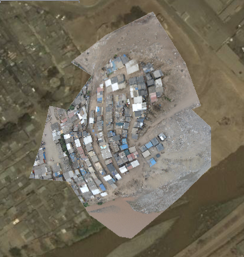
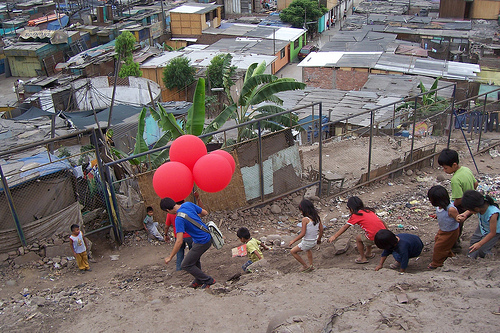
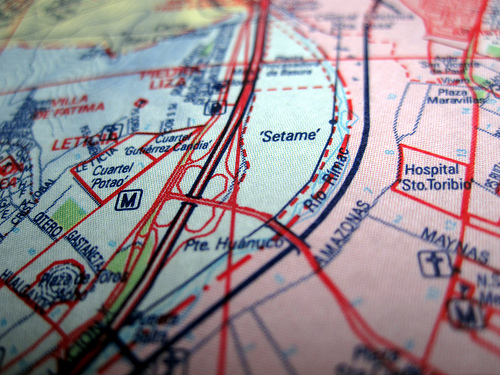
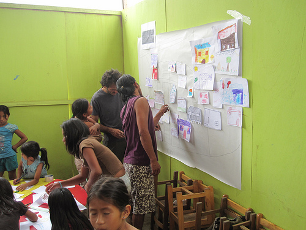
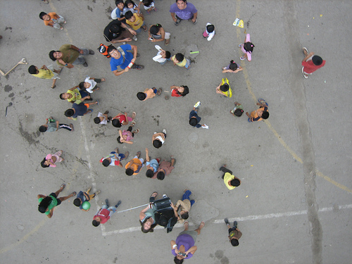

Yesterday turned out to be a fantastic day &#8211; [Daniel Miracle](http://neokinok.tv/) and others from [Escuelab](http://escuelab.com) took me out to visit a community called Cantagallo which they&#8217;ve been working with for some weeks. Daniel sets up TV transmitters and creates local TV stations with a range of ~500 meters for only about $300. 

The Cantagallo community is a group of Shipibo, a group native to the Amazon region of Peru, near Pucallpa. About 100 families have moved here to the bank of the river Rimac here in Peru, on top of a landfill, starting about 9 years ago. They&#8217;re currently in negotiations to gain a title to the land they&#8217;ve been living on, which the Escuelab folks believe belongs to the Municipality of Lima. They invited me out to come make maps with them in the hopes that the resulting data can support their territorial claim. Seeing a community so tightly knit, isolated on top of a small hill, in the middle of a metropolis of 11 million people, was pretty stunning.

The Shipibo kids were very sweet and with the exception of one kid who threw a rock at the balloons and popped one (he was sorry and pretty sad afterwards when I explained we&#8217;d used all our helium and couldn&#8217;t send the camera up anymore), very helpful with the kites and the balloons. There was some wind but we couldn&#8217;t get the kites to pull consistently, so we inflated 4 balloons and that worked fabulously! We managed to take clear, detailed photos of the entire site, and I rectified them last night in just about an hour. I&#8217;m doing a rectifying workshop at Escuelab today and have also promised to show Nancy and Carla from Manzanita &#8220;A&#8221; how to do this. See above the resulting map overlaid on Google Earth imagery, which looks to be about 3-4 years old. And of course nothing is shown on a standard paper street map of Lima:

I thought it was really interesting that the community still actively uses the Shipibo language, but also that there&#8217;s a debate among parents there as to whether it should be taught; some think that Spanish alone would be more useful for their kids. The state-run school there is bilingual. Other aspects of the Cantagallo community also show their dual desires to hold on to their cultural roots while still being successful in modern Lima. According to Daniel, even their choice of location &#8211; next to the Rimac river &#8211; was because they were accustomed to living next to a river and fishing.

We also managed to take a picture of a map the Shipibo of Cantagallo are using as part of their title negotiations &#8211; and hope to fill it out with streets, homes, etc. More on this soon.

And as we&#8217;ve been having a lot of success with paper mapping with kids in Juan Pablo II, we made a big collage map with the Cantagallo kids as well. We had a lot of help from Layner Morih, a young Shipibo guy who has a great rapport with the kids &#8211; he encourages them to speak in both Spanish and Shipibo. You can see him in a purple shirt helping assemble the drawn map.

_Lots more pictures [on Flickr](http://flickr.com/photos/tags/grassrootsmapping)_

