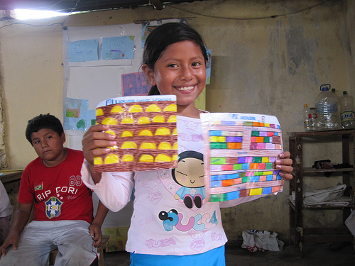
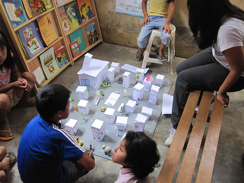
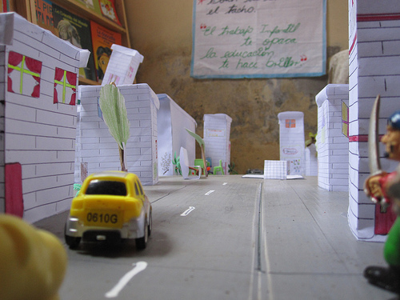

The CEDRO teachers and I were inspired by Jay Silver&#8217;s work with [Awareness Mapping](http://civic.mit.edu/projects/c4fcm/awareness-mapping) ([watch his presentation here](http://techtv.mit.edu/tags/345-media/videos/4477-awareness-mapping)) and so we&#8217;ve been doing some paper mapping exercises, though focusing more on history and buildings and such. The &#8216;history of the community&#8217; project ([view on Flickr](http://www.flickr.com/photos/jeffreywarren/sets/72157623292820418)) went so well that we assigned a &#8216;future of the community&#8217; assignment and asked kids to bring in maps or drawings of the community in 5-10 years. They came back with some great stuff (see the [project]() on Flickr), and two students went nuts and made a whole scale model of the neighborhood (7 years from now) in 3D!

Notice the great attention to detail in multiple story homes. There&#8217;s a pharmacy, hair salon, etc. I&#8217;ll be uploading more photos of this assignment soon, including a panorama of the model town!

