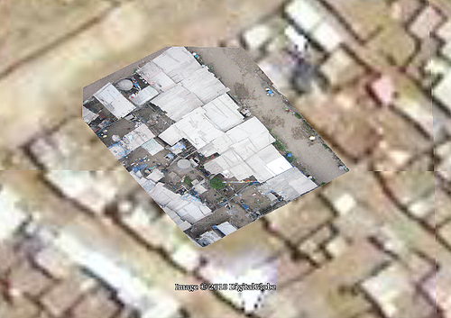

We&#8217;re working to process and rectify all the imagery we captured on Thursday, but here&#8217;s an initial attempt at rectifying an image. I must admit I was initially discouraged that the Google map seemed pretty decent (it&#8217;s supplied by [DigitalGlobe](http://www.digitalglobe.com/)) but now that I&#8217;m trying to actually rectify images against it, it&#8217;s really almost unusable! 

I can&#8217;t see any useful detail, and almost all of the houses have moved or changed&#8230; about one in a hundred roofs match up, making it very difficult to rectify. I think we need one really good very high altitude shot to fix our overall layout, then we can rectify the lower altitude, higher detail imagery. We&#8217;ll try Tuesday afternoon.