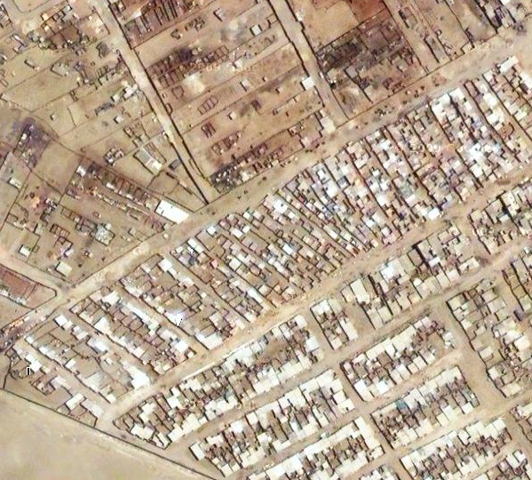

Here&#8217;s Juan Pablo II (as far as I can tell) on Google Maps. ([Link here](http://maps.google.com/maps?f=q&#038;source=s_q&#038;hl=en&#038;geocode=&#038;q=&#038;sll=-12.230851,-76.959915&#038;sspn=0.015309,0.043945&#038;ie=UTF8&#038;ll=-12.231391,-76.950088&#038;spn=0.001914,0.005493&#038;t=h&#038;z=18))

It doesn&#8217;t look so bad in fact&#8230; we&#8217;d expected older imagery. But the detail is not quite good enough to make out which homes are which, and there are no labels or anything, so it&#8217;s quite hard to figure out where you are. We&#8217;ll see how these sync up with the higher resolution balloon imagery we capture&#8230; hopefully tomorrow!

_

### Related Posts:

*   [Umm Salamuna kite mapping](http://grassrootsmapping.org/2009/12/umm-salamuna-kite-mapping/)
*   [Kite-video generation of aerial imagery](http://grassrootsmapping.org/2010/01/kite-video-generation-of-aerial-imagery/)
*   [Initial Map Warper test with kite imagery](http://grassrootsmapping.org/2010/01/initial-map-warper-test-with-kite-imagery/)
*   [Mapping with balloons, kites, and kids &#8211; first flights with Juan Pablo II in Lima](http://grassrootsmapping.org/2010/01/mapping-with-balloons-kites-and-kids-first-flights-with-juan-pablo-ii-in-lima/)
*   [Neutrality and cartography in Cantagallo](http://grassrootsmapping.org/2010/02/neutrality-and-cartography-in-cantagallo/)_
