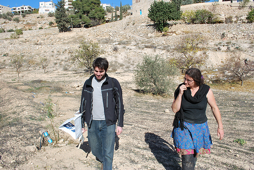
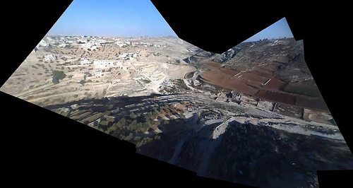
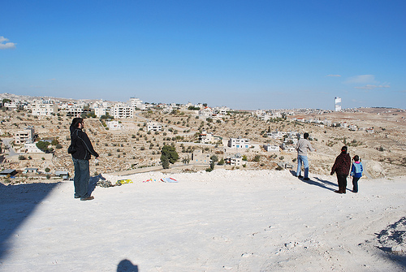

The day after [working with landowners and activists in Umm Salamuna](http://unterbahn.com/2009/12/umm-salamuna-kite-mapping-test/) in the West Bank, we stopped by to visit Alice Gray, who organized the protest. She runs a permaculture farm project in Bethlehem called [Bustan Qaraaqa](http://www.bustanqaraaqa.org/), and was interested in mapping the farm periodically to monitor growth and erosion. She was quite excited about the kite concept so we thought we'd give it a try.

The attempt was somewhat frustrating - while the day before we had over 30mph winds, at the farm we had the opposite problem: very little wind. BQ is located in a sharp valley where it's hard to get a view from above (see picture) but we finally managed to loft a small parafoil kite (thanks Nadya!) with an iPod nano attached. We let it out about 500 feet, but the kite flew at a very low angle, and in the wrong direction. In the end we got a reasonable image of the other side of the valley, which we'll try to rectify as a proof of concept.

We're using VLC to review frames manually, saving the clearest ones as PNG images. Then we use [hugin](http://hugin.sourceforge.net/) with the SIFT algorithm to auto-stitch the video frames together. This is a bit involved and if we continue using video we may want to make a web interface to do this automatically. As in: point it at a YouTube video and it generates a panorama as well as it can and opens it in [Map Warper](http://warper.geothings.net). As it turned out, the hilly terrain proved too much to successfully warp this capture into a usable map; see the [final product](http://maps.google.com/maps?f=q&source=s_q&hl=en&geocode=&q=http:%2F%2Fwarper.geothings.net%2Fmaps%2F1912.kml&ie=UTF8&ll=31.693338,35.229206&spn=0.012452,0.043945&t=h&z=15). What we need is a much higher point of view, if there are going to be any hills. Luckily some of the kites I bought in San Juan last week are ideal for this - and they fly much more vertically so we won't have to worry about being as far upwind of the target site. 

These two days definitely show the 'worst case scenario' for this kind of mapping... super high and low winds, steep valleys and ridges, low-res video and time limitations. Anyways the best part of the day was when two Palestinian kids and their dad came out to see who the idiots were who couldn't fly a kite... and helped us get one in the air:

Coming soon - our last day of mapping in the middle east was at the Royal Scientific Society of Jordan, where we captured some absolutely fantastic images under some of the best conditions we've seen so far. 