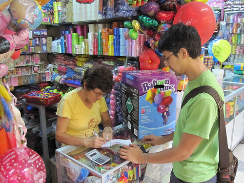
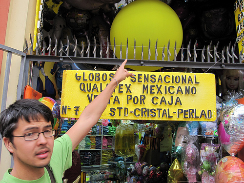
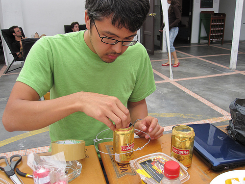

[Seth Hunter](http://www.perspectum.com/) and I landed in Lima Wednesday morning at about 7am, and after resting up a bit, we set out to find some helium for the planned grassroots mapping workshops. A cab driver took us to the Centro de Lima, to Calle Japon (more or less Chinatown) where a lot of party stores can be found. After asking around a bit, we found ourselves in a galeria called Dorado, in which several vendors had large tanks of helium.

After some negotiation we managed to buy 2 small pink tanks of helium which are single-use, for 96 soles each, or about US$34. Some &#8216;math&#8217; tells me this will fill a single 5-foot diameter balloon, or several 3-foot balloons. This is about double the price of helium in the US, but not prohibitive. If we want to save money, we should lighten the payload so it fits on a single 3-foot balloon, which incidentally is sold here in Lima also, for 36 soles, or about US$13 each.

We&#8217;re also prototyping a hot air balloon design (using some guides we&#8217;ve found and put [on the wiki](http://wiki.grassrootsmapping.org/wiki/show/HotAirBalloons)) and should do a first flight test today. The candles we bought were too weak so we&#8217;re trying to buy some Sterno (no luck yet) and may try a beer-can alcohol stove today. I&#8217;m dubious about fire safety with airborne fire over a neighborhood with no fire department&#8230; but Sterno should be safe, and a small alcohol stove using low concentration rubbing alcohol&#8230; we can at least test it here by the hostel and see what the risks are. 

We also set up a meeting on Sunday with Ysabel and Carla, friends of mine (Carla works with [CEDRO](http://www.cedro.org.pe/), our partner organization here in Lima) and Hector from Bruce Peru, as well as Ernesto from CEDRO. Hopefully we&#8217;ll figure out a working schedule and generally get people excited about the project.

_

### Related Posts:

*   [Mapping with balloons, kites, and kids - first flights with Juan Pablo II in Lima](http://grassrootsmapping.org/2010/01/mapping-with-balloons-kites-and-kids-first-flights-with-juan-pablo-ii-in-lima/)
*   [Grassroots Mapping Wiki launched](http://grassrootsmapping.org/2009/12/grassroots-mapping-wiki-launched/)
*   [First day of mapping in invasion Juan Pablo II, in Lima, Peru](http://grassrootsmapping.org/2010/01/first-day-of-mapping-in-invasion-juan-pablo-ii-in-lima-peru/)
*   [Possible legal role for grassroots mapping in Lima](http://grassrootsmapping.org/2010/01/possible-legal-role-for-grassroots-mapping/)
*   [Continued kite-flying and paper mapping](http://grassrootsmapping.org/2010/01/continued-kite-flying-and-paper-mapping/)_
