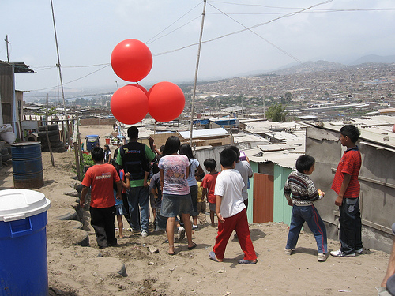
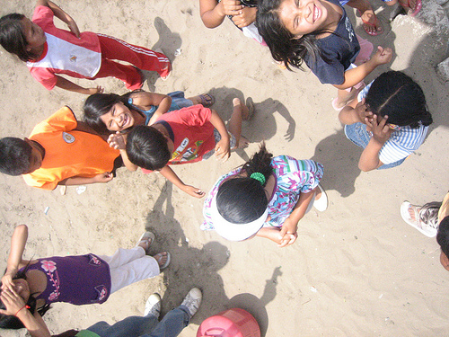
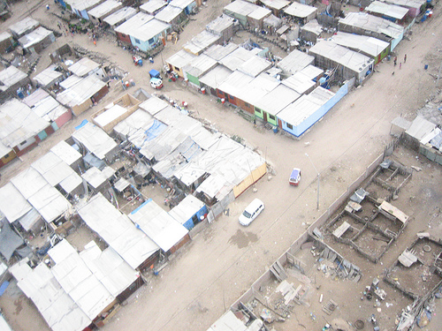
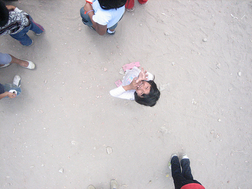

Yesterday Seth Hunter and I had our big flight with teachers from [CEDRO](http://www.cedro.org.pe/) and Manzanita &#8220;A&#8221; and the kids from invasion Juan Pablo II, and everything went extremely well. We started by reviewing the Google Maps imagery of the area (see [previous post](http://grassrootsmapping.org/2010/01/juan-pablo-ii-on-google-maps/)) and discussing their new homework project of writing about the history of the community, when their family arrived and from where, etc. (see the full homework on the [Grassroots Mapping wiki](http://wiki.grassrootsmapping.org/wiki/show/TareaDeHistoria)). This was put together with the team from CEDRO &#8212; Ernesto, Sandy, Sara, and others, whose fantastic work and thorough understanding of the kids we&#8217;re working with has made this all possible. I&#8217;ve been very impressed with their personal commitment to the community &#8211; they know all the kids and their families, and have a very good rapport with the residents of Juan Pablo II.

After a short discussion of the [camera rig](http://wiki.grassrootsmapping.org/wiki/show/BalloonAerialPhotography) and some helium safety tips/rules, we set out to launch our first balloon &#8211; or rather 5 balloons, which is what it took to launch our camera. 

However, there was quite a bit of wind, and things got a bit turbulent. The rig kept getting pushed down by gusts, and with all the DIY electrical wiring around, we told the kids to let go of the string for a bit. Ultimately, though, we had a big crowd, and the kids helped with everything from filling balloons to tying the rigging &#8212; and most importantly, they had a ton of fun. 

We were unsure about the pictures we&#8217;d get, and indeed we didn&#8217;t really get high enough with the balloons (see above) so later, with a smaller group of kids we tried flying kites, which worked fantastically &#8211; we got the camera up quite high and captured some really good imagery which we hope to rectify later today or tomorrow. To produce a complete map, we expect to repeat kite/balloon flights over the next week or so.

All in all, the day went terrifically well; many thanks to the aforementioned members of CEDRO as well as Carla del Carpio and Nancy, who were also there to participate. 

_The complete set of photos of the event are being uploaded to Flickr [under the tag &#8220;grassrootsmapping&#8221;](http://flickr.com/photos/tags/grassrootsmapping/)._

<iframe align="center" src="index.gne?tags=grassrootsmapping" frameBorder="0" "width=500" height="500" scrolling="no"></iframe>