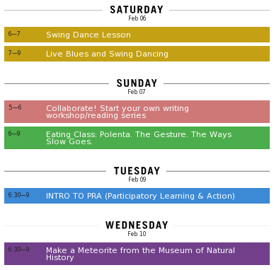

Caroline of [OurGoods.org](http://ourgoods.org) has organized a "[Trade School](http://tradeschool.ourgoods.org/)" where you can come to learn or teach among peers!

> Take a class every night with a range of specialized teachers in exchange for basic items and services. Secure a spot in a Trade School class by meeting one of the teacher's barter needs.
> 
> 
> Come to Trade School for thirty days of classes, co-working and bartering at GrandOpening's Lower East Side storefront from January 25 to February 28, 2010.