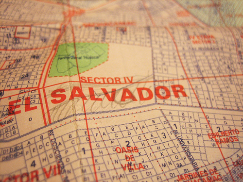

Today I met with Ysabel, Carla, and Nancy, and reviewed the month-long mapping project plan. The meeting went well; all three are excited about the project and we agreed to meet Tuesday morning to head out to Juan Pablo II, the first invasion (what they call the settlements here) we&#8217;ll be working in, where we&#8217;ll meet [CEDRO](http://cedro.org.pe) partner Ernesto, and the kids we&#8217;ll be working with. See the &#8220;blank spot on the map&#8221; above, where Carla and Ysabel sketched in the invasion.

We also identified several potential mapping sites, and they told me that in order to be recognized, inhabitants of invasions are required to submit a map of the area they are claiming, signed by an architect or civil engineer, to the government of Lima. They seem to think that the maps we produce will be accepted, and that the signature is just a formality. I hope this is true; I was prepared to accept that we&#8217;d only use the maps as planning tools and as an exploratory process for residents, but I&#8217;d secretly hoped that we could play some role in the invasion legitimization process as well. It now seems like that may be possible.

_

### Related Posts:

*   [Landed in Lima, found helium](http://grassrootsmapping.org/2010/01/landed-in-lima-found-helium/)
*   [First day of mapping in invasion Juan Pablo II, in Lima, Peru](http://grassrootsmapping.org/2010/01/first-day-of-mapping-in-invasion-juan-pablo-ii-in-lima-peru/)
*   [Mapping with balloons, kites, and kids - first flights with Juan Pablo II in Lima](http://grassrootsmapping.org/2010/01/mapping-with-balloons-kites-and-kids-first-flights-with-juan-pablo-ii-in-lima/)
*   [Initial Map Warper test with kite imagery](http://grassrootsmapping.org/2010/01/initial-map-warper-test-with-kite-imagery/)
*   [Completed, printed map of Juan Pablo II!](http://grassrootsmapping.org/2010/01/completed-printed-map-of-juan-pablo-ii/)_
