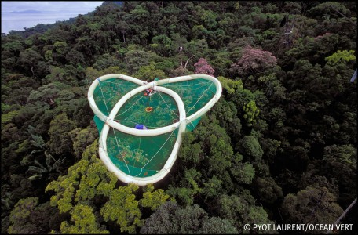

I remember seeing this in a documentary when I was a child - French field biologists created a giant inflatable netted raft which sits above the rainforest canopy, and from which they can rappel down into the trees to take samples and do observations. The researchers lived on the raft for an extended period in tents. What an enchanting idea! They've apparently done expeditions since the 80s.

[Read more](http://www.radeau-des-cimes.org/)