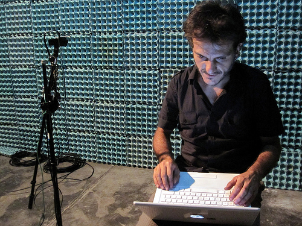
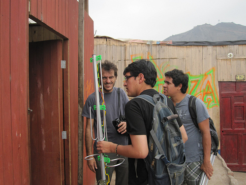
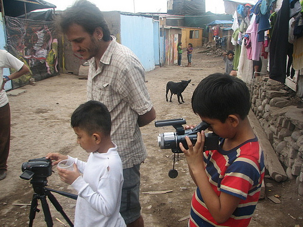

[Daniel Miracle](http://neokinok.tv/) is in the midst of a month-long project with Lima-based art/technology/culture program [Escuelab](http://escuelab.org), where he has been collaborating with a group of arts-oriented members of the Cantagallo community on a range of projects. Most excitingly, he's been setting up a hyperlocal TV station with a range of only a few hundred meters -- and helping kids from Cantagallo broadcast live TV programs on channel 39. (Some programs are taped and are available [on the group's web site](http://shuawa.escuelab.org/content/shuawaTV)) The entire transmitting setup (parts of which you can see in the picture below) cost around $200. I was amazed to see kids interviewing each other on live TV in the Shipibo language -- asking questions like 'why did we move to Lima' and so forth.

The Shipibo arts group is called Shuawa after the 'satellite bird' from Shipibo legend; the shuawa bird acts as a network to relay messages among Shipibo maestros. With Daniel's support, Shuawa has also been running arts workshops for kids, including video and hand-drawn animation. As part of their workshops, Carla del Carpio and I were lucky enough to be able to do some [Grassroots Mapping](http://grassrootsmapping.org) sessions there. (The coincidence of the meaning of Shuawa and the "people's satellite" we built as part of our balloon mapping work there was great!)

This project was super inspiring to me -- above all because among media technologies, I think of television as the least participatory, and as one which is typically used to support centralized power structures. While Daniel isn't the first to use short-range television broadcasting as a community-run cultural medium, it's nevertheless a very exciting inversion of an 'old' technology. 

