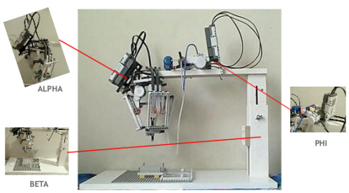

A University of Washington-based [IGEM 2009](http://2009.igem.org) team (see [project page](http://2009.igem.org/Team:Washington-Software)) has created a Lego-based robot to assist gene synthesis researchers - for only $700 in parts, as opposed to the over $100k price tag of a commercial liquid handling robot (see for example [Tecan's Freedom EVO](http://www.tecan.com/platform/apps/product/index.asp?MenuID=2694&ID=5270&Menu=1&Item=21.1.8) product). 

This reminds me strongly of Jonathan Ward's [MTM A-Z](http://mtm.cba.mit.edu/machines/mtm_az/index.html) personal fabrication machine, developed at the [Center for Bits and Atoms](http://cba.mit.edu) at MIT. I bet Jonathan & co. could make a cheaper and more powerful machine for less... they should collaborate!

Read about a hard-working team which competed in iGEM's 2009 event without access to a robot in a [recent New York Times Magazine article](http://www.nytimes.com/2010/02/14/magazine/14Biology-t.html).