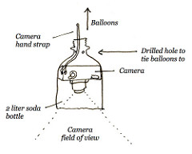

[Pat Coyle](http://wiki.grassrootsmapping.org/wiki/show/PatCoyle) and I are starting work on an illustrated guide to grassroots mapping with balloons. Visit the [wiki page](http://wiki.grassrootsmapping.org/wiki/show/IllustratedGuide) to see our initial notes and sketches.