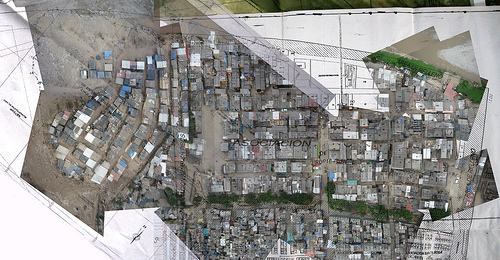
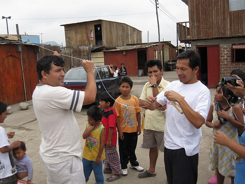
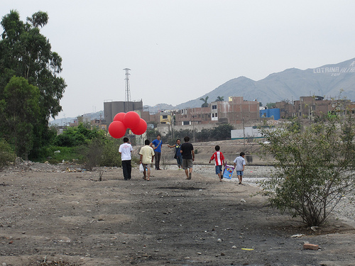

Another day, another new grassroots map! After working with residents of Cantagallo at the beginning of February to produce [the first map of their community](http://grassrootsmapping.org/2010/01/grassroots-mapping-with-the-shipibo-in-the-center-of-lima/) with [Daniel Miracle](http://neokinok.tv/) of [Escuelab](http://escuelab.org), we met with members of another of the 3 groups of Shipibo living in the same zone in the center of Lima. Upon seeing the maps we&#8217;d made, they were excited to make one also.

Sara Gomez of [CEDRO](http://www.cedro.org.pe/), who introduced us to Sr. Ricardo, the president of one of the multiple political groups in Cantagallo, pointed out that if we make a map, we should do the best to serve all parties who live in Cantagallo &#8211; meaning that, among other things, we should create a single map of the entire settlement, collaborating with as many groups as we can, and distribute it as widely as possible. The situation was complex &#8211; the political groups don&#8217;t break down along clear geographic lines, but they are engaged in geographic dispute, and are submitting separate bids for state recognition. I&#8217;m still struggling with how to aid these groups in their bid for land title without getting pulled into a local political conflict &#8212; if that&#8217;s even possible. We cannot say, for example, that this mapmaking is a neutral act &#8211; but we can try to create tools which support equal access to geodata, and which are hard to use in exclusionary ways.

It remains to be seen how this plays out, but at the very least, we were able to work with a Señor Ricardo &#8211; president of one of the other Shipibo groups &#8211; to make a more complete map. Politics aside, once you get outside and start flying balloons, everyone becomes an excited kid, at least for a while. 

My hope is that these maps will support all parties&#8217; claims to title in their negotiations with the Municipality more than they create or further aggravate disputes between the various groups in Cantagallo. I&#8217;ll be staying in close contact with my friends there to see what happens.

