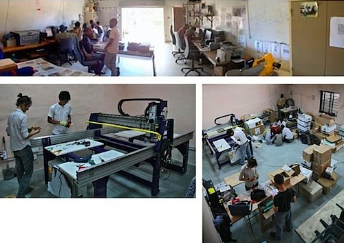
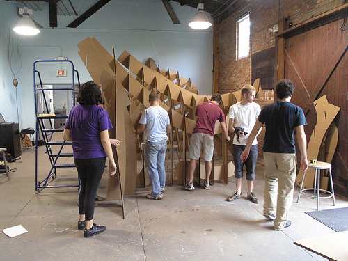

[Nadya Peek](http://infosyncratic.nl/) at the [Center for Bits and Atoms](http://cba.mit.edu) at MIT is leading up an effort to get a [FabLab build in Haiti](http://haitifablab.org), so that as reconstruction progresses, Haitians have an opportunity to circumvent the traditional manufacturing and supply chain paradigm -- and to create a broad range of goods for themselves. 

A [Fab Lab](http://fab.cba.mit.edu/) are high-tech and relatively expensive 'universal factory in a box' - including a ShopBot CNC, laser cutter, and so forth, with which you can make all kinds of electronics, furniture, replacement parts, and even [more machines](http://mtm.cba.mit.edu/machines/mtm_az/index.html). They exist in a variety of places around the world and part of having a Fab Lab is being connected with a global network of makers and tinkerers at other Fab Labs.

I initially balked at the idea of spending $250k (yowza!) on something like this, but I think that enabling and empowering Haitians to challenge the global manufacturing powers-that-be is a fundamentally important part of helping Haiti become self-sufficient. Once the 'theatre of disaster' shifts to somewhere else, and the spotlights move to other disasters, a Fab Lab will support their years-long reconstruction effort.

But first they need $250k, so please [consider donating!](http://haitifablab.org)