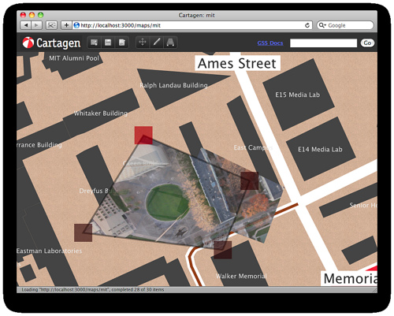

Some of you have seen the above [screenshot on Flickr](http://www.flickr.com/photos/jeffreywarren/4420602473/); don&#8217;t worry, we&#8217;ll be launching it soon! As some of you may recognize, we&#8217;re duplicating the &#8216;distort&#8217; functionality from Photoshop, similarly to what [Michal Migurski suggested last November](http://mike.teczno.com/notes/canvas-warp.html).

Also, [Chris Blow](http://unthinkingly.com/) asked about how we&#8217;re dealing with very large batches of photos&#8230; well, yeah, we&#8217;ve used [hugin](http://hugin.sourceforge.net/) for mass stitching&#8230; but it was so much easier to explain to people how the hand-warping interface works (i.e. &#8220;it&#8217;s like the images are made of rubber&#8221;) to non-technical participants, that for small mapping projects we wanted to use this paradigm.

Also we&#8217;ve been talking to NASA AMES about using their [/Vision Workbench](http://ti.arc.nasa.gov/project/nasa-vision-workbench) software, perhaps as part of a rectifying web service for folks who have large sets. So basically we&#8217;re pursuing different strategies for bulk/expert use and for novice/small-scale mapping.

From my experience in Lima, using photoshop&#8217;s distort tool (which works like the above) was actually faster than doing control point generating and stitching with hugin. But we generally only took like 20 photos max; these communities were pretty small.