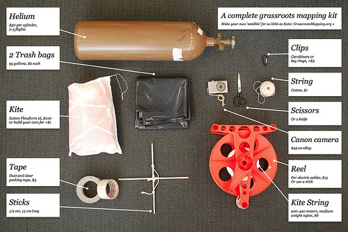

After some discussion on the [mailing list](http://groups.google.com/group/grassrootsmapping/), I put together this poster/handout image which shows everything you need to make a balloon or kite map (besides people!). Feel free to distribute! I&#8217;ll start printing this on the back of the print maps I make, and hopefully this will help people get started making their own maps.

Download the [Full size image](http://unterbahn.com/wp-content/uploads/2010/03/4445981062_1f6397fcec_o.jpg)