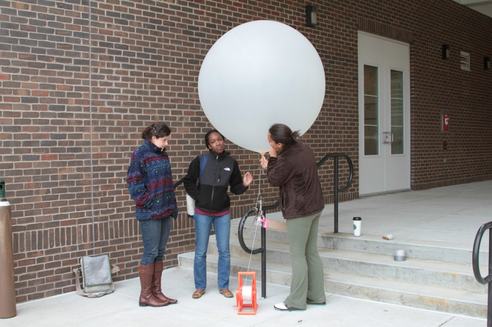
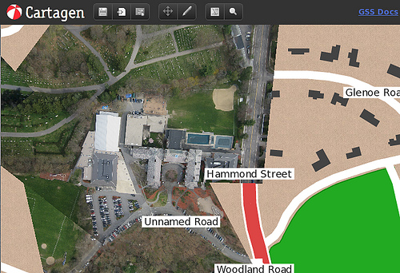

The [NuVu workshop](http://wiki.grassrootsmapping.org/show/NuVuWorkshop) at [Beaver Country Day School](http://www.bcdschool.org/) near Boston started today, and participants Mariah, Danielle, Hayley, and Nicky flew 3 different &#8216;DIY satellites&#8217; over the school&#8217;s campus, capturing some great imagery, and assembling the map below.

Read more on Saeed&#8217;s post at the NuVu blog: &#8220;[First day of balloon studio](http://nuvustudio.org/balloon/the-first-day-of-balloon-studio/)&#8221;

