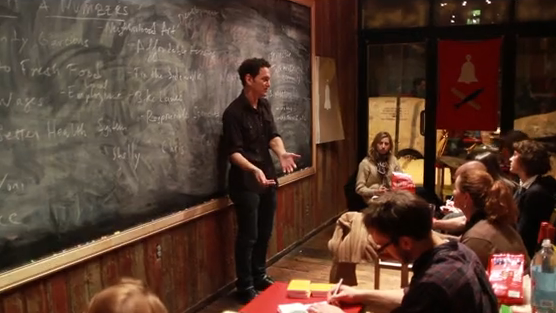

[Trade School](http://tradeschool.ourgoods.org/) is a fantastic 'teach people things for barter' program organized by Caroline Woolard in NYC. Read about them on the New York Times City Room blog: [blog post](http://cityroom.blogs.nytimes.com/2010/02/23/a-trade-school-where-ideas-are-currency/) where they're described as "A Trade School Where Ideas Are Currency"

I donated $150! Donate here: [Trade School on Kickstarter](http://www.kickstarter.com/projects/OurGoods/trade-school-0)

> **What is Trade School?**
> 
> 
> At Trade School, students barter for instruction. We turn storefront space into a platform for learning, a place where enthusiasts and specialists teach in exchange for basic items from students. Anyone can offer to teach a class. Students sign up for classes by agreeing to meet the teacher's barter needs. We ran Trade School for 35 days and we want to open again!