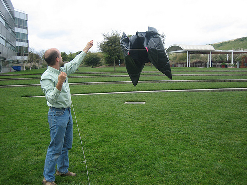
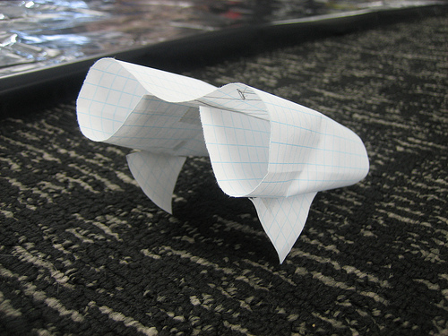

We&#8217;ve had a lot of trouble with winds between 5-10 mph, where it&#8217;s not enough for a kite, but too much for a balloon&#8230; so this weekend at WhereCamp a few of us designed and built a hybrid kite-balloon, which we named [Black Knight 1](http://wiki.grassrootsmapping.org/show/HeliumKite), made from a 99-gallon trash bag.

Sadly, after a lot of careful work, it immediately exploded! But in fact it made a pretty passable large sled kite, even after falling apart. So we learned a lot, and are moving forward on the Black Knight 1.1. I encourage anyone interested to tackle this problem, since it just takes a lot of plastic and packing tape! Basically it&#8217;s a balloon which acts as an airfoil, so that instead of a light wind pushing the balloon down onto the ground again, it provides lift and flies more vertically.

We really need an &#8216;open source&#8217;, easy-to-build design for a kite-balloon! Read more about the concept and upload pictures and notes from your own experiments at [Helium Kite page](http://wiki.grassrootsmapping.org/show/HeliumKite) on the Grassroots Mapping [wiki](http://wiki.grassrootsmapping.org). 

