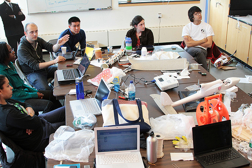
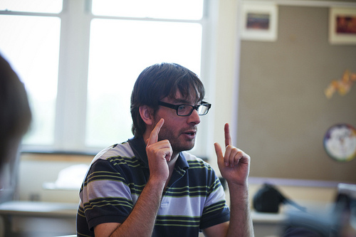

[Jean-Babtiste Labrune](http://web.media.mit.edu/~labrune/) and [Oliver Yeh](http://space.1337arts.com/) joined us for the final day of the [NuVu Studio workshop](http://nuvustudio.org/balloon/the-finale-of-the-balloon-studio/) on grassroots mapping, where all the students presented their work and we had some good discussion &#8211; both about mapping techniques and on a conceptual level. JB spoke a bit about DIY culture and Oliver showed some of his high-altitude ballooning work.

This was a great chance for students to push some of our [Advanced Projects](http://wiki.grassrootsmapping.org/show/AdvancedProjects) forward, and has built on previous work such as the [Kite Balloon prototype](http://grassrootsmapping.org/2010/04/kite-balloon-prototyping/) we built during WhereCamp 2010. 

_Vanessa on [aerodynamic balloons](http://grassrootsmapping.org/2010/04/nuvu-student-project-presentations/vanessa_balloons-2/)  

Mariah on [hot air balloons](http://grassrootsmapping.org/2010/04/nuvu-student-project-presentations/mariah_balloons/)  

Hayley on [RC airplane mapping](http://grassrootsmapping.org/2010/04/nuvu-student-project-presentations/hayley_plane/)  

Danielle on [helium-filled kites](http://grassrootsmapping.org/2010/04/nuvu-student-project-presentations/dani-balloon-mapping/)  

Julian on [mapping Skyline Park in Chestnut Hill](http://grassrootsmapping.org/2010/04/nuvu-student-project-presentations/nuvu-julian/)  

_

A BCDS math teacher named Rob also joined us and provided some valuable criticism and hand gestures ([CC-SA](http://creativecommons.org/licenses/by-sa/2.0/deed.en) by [jeanbabtisteparis](http://www.flickr.com/photos/jeanbaptisteparis/)):

