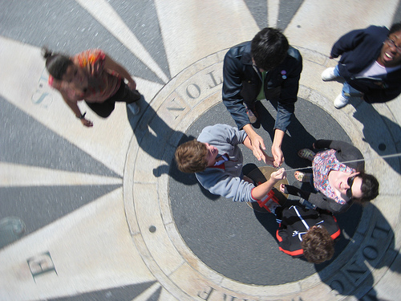
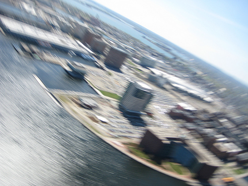

We&#8217;ve been doing some great building and flying at the [NuVu workshop](http://nuvustudio.org/) this week and last; I wrote a blog post about it for the PBS IdeaLab blog. Also check out the [photos on Flickr](http://www.flickr.com/photos/tags/nuvu)

[Read the article](http://www.pbs.org/idealab/2010/04/helium-baloons-with-digital-cameras-create-grassroots-maps104.html)

An excerpt:

> This isn&#8217;t exactly your typical high school activity. My workshop at Beaver Country Day School is part of a series of studio design-style courses that make up the NuVu Studio &#8212; an experimental education project where the students get hands-on exposure to topics like alternative energy and &#8220;the future of labor.&#8221;
> 
> It differs quite a bit from other workshops I&#8217;ve taught in places like Amman, Jordan and Lima, Peru, in that the idea of &#8220;subjective geography&#8221; seems somewhat less immediate. I didn&#8217;t have to explain to anyone in the West Bank, for example, that mapping is not a neutral act, or that it&#8217;s a social construction with a profound political meaning and agenda. But here in Walnut Hill that seems a bit distant&#8230;

