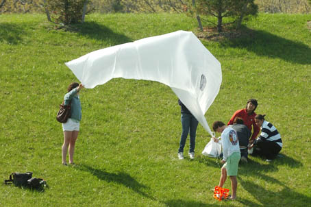

Last Thursday in the [NuVu Studio workshop](http://wiki.grassrootsmapping.org/show/NuVuWorkshop), we flew an experimental aerodynamic balloon modeled after a shark&#8217;s body at Skyline Park, a former landfill which has been converted to playing fields. A Brookline TAB photographer caught us launching (see above photo) and we made it into their blog:

[full (short) article at the Brookline Tab Blog](http://blogs.wickedlocal.com/brookline/2010/04/22/leave-it-to-beaver/)

I mentioned this on the [mailing list](), but we subsequently lost the balloon due to a bad knot (my fault!). This is our first balloon lost! We&#8217;ll be more careful with knots from here on out &#8212; apologies to Vanessa and Julian, who built the balloon!