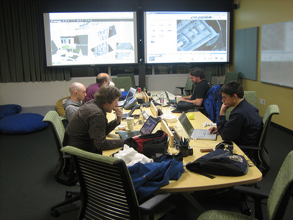

WhereCamp was a blast &#8211; lots of people brought kites and such, and we managed to get a pretty good set of photos of the area of the Google campus we were &#8216;camped&#8217; at (almost entirely due to the expertise and kite-flying of Eric Wolf). I demoed the new [Cartagen Knitter](http://cartagen.org/maps) and on Saturday night a bunch of us started to knit a map together, called &#8220;[Deathstar Plans](http://cartagen.org/maps/Deathstar-Plans)&#8220;. Check it out!

Actually it was mostly them (see picture below) trying to knit, and me fielding bugs, new feature requests, and so forth&#8230; it was the first time a bunch of people had gotten together to stitch a map at the same time, each on their own laptop. The feedback was great, and I was writing code and publishing it until 3am.

You can now &#8216;lock&#8217; images you&#8217;re done knitting, and the tool is quite a bit more useable. Thanks again to everyone!

