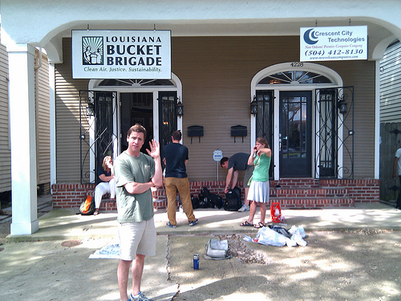
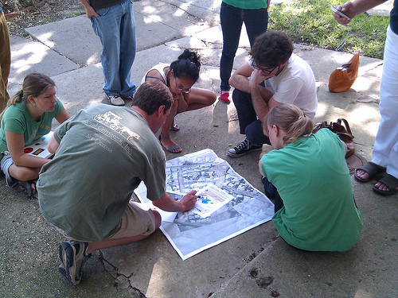

A bit of an update &#8211; on Thursday we went down to Grand Isle and met up with folks from [Priority5](http://priority5.com) and the [Greater Lafourche Port Commission](http://www.portfourchon.com/) who fed us delicious food and managed to get us out on a boat near sunset. We focused on testing the theory (suggested on the mailing list at some point) that we could tow a kite even in low winds&#8230; and amazingly it worked. The light was failing however and we did not get a lot of imagery. That stuff was posted [this morning](http://grassrootsmapping.org/2010/05/kite-towing-tests-at-grand-isle/) (gosh it seems like a million years ago).

We met this morning with a whole lot of volunteers (want to [volunteer?](https://spreadsheets.google.com/viewform?formkey=dEY4LTJXUDZvYkpKNXhtTmlhZW5RRXc6MQ)) at the [LA Bucket Brigade](http://www.labucketbrigade.org/) to plan a teaching strategy to increase the number of mappers and to make sure local folks were able to do balloon/kite mapping. 

Tomorrow, we&#8217;re conducting a training session:

## May 8 Training Session

10:00AM This Saturday we are meeting at City Park, New Orleans. Meet on the Southeast side of the Art Museum, look for us out on the lawn. The session will examine the field mapping setup, and how to train others to follow the same model. Come out to see how it is done, and learn how to do it yourself. Google Map link to City Park:

[City Park, art museum map](http://tinyurl.com/2b8bxd3)

The focus is not on signing up a zillion people (yet!), but in finding local potential mapping leaders, who can organize teams of volunteers to go out to beaches and coasts to map the spill. We'll try to schedule a mapping trip for you in the next day or two so you'll have the experience to bring others out as well.</em>