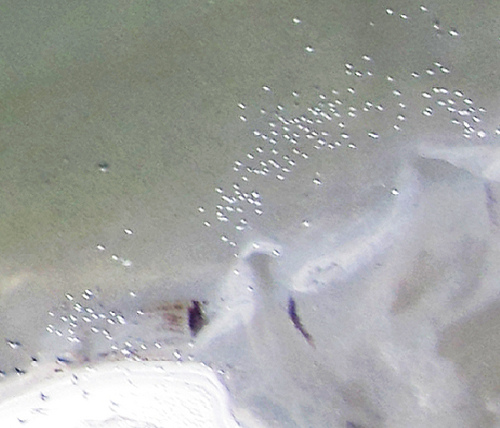

[Stewart Long](http://gonzoearth.com) finished up a fantastic stitched map from the trip he led on May 9th to the southern [Chandeleur Islands](http://maps.google.com/maps?f=q&#038;source=s_q&%23038;hl=en&%23038;geocode=&%23038;q=chandeleur+islands&%23038;sll=37.0625,-95.677068&%23038;sspn=39.184175,53.876953&%23038;ie=UTF8&%23038;hq=&%23038;hnear=Chandeleur+Islands,+E,+St+Bernard,+Louisiana&%23038;t=h&%23038;ll=29.803412,-88.859696&%23038;spn=0.010501,0.021329&%23038;z=16). Using a helium balloon, he and a group from [Louisiana Bucket Brigade](http://labucketbrigade.org) produced this extremely high resolution map of an oil slick surrounding a sandbar. 

The boat was offered by Jim Smith of [Uptown Angler](http://uptownangler.com) (we were put in touch with him via Spencer Moss of [FishingGuidesWorld.com](http://fishingguidesworld.com)) &#8212; many thanks!

_You can view the full map in OpenLayers here: [tiled web map](http://maps.grassrootsmapping.org/may-9-chandeleur-balloon/)  
There is also a GeoTiff: [chandeleur-balloon.tif](http://stewart.s3.amazonaws.com/chandeleur-balloon.tif) (278mB)_

What&#8217;s truly amazing about this map is that you can see individual birds and streaks of oil on the sandbar at the bottom (see below for full resolution).

<iframe width="500px" height="400px" scrolling="no" marginwidth="0" marginheight="0" frameborder="0" src=""></iframe>