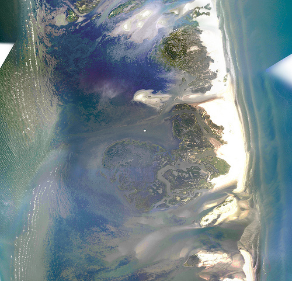

Using imagery from Stewart Long&#8217;s May 8th overflight of Chandeleur islands, we&#8217;ve stitched together a map layer. A sample is above, and you can view the complete map here:

and it&#8217;s also [viewable in OpenLayers](http://maps.grassrootsmapping.org/chandeleur-may8-plane/) or in Google Earth as a [KML file](http://maps.grassrootsmapping.org/chandeleur-may8-plane.kml)

For those who want the full geotiff, [here it is](http://maps.grassrootsmapping.org/may-8-chandeleur-flight-epsg-4326.tif) (522mB)

<iframe width="500px" height="400px" scrolling="no" marginwidth="0" marginheight="0" frameborder="0" src=""></iframe>