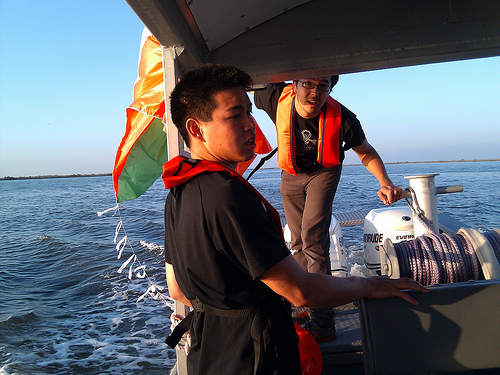
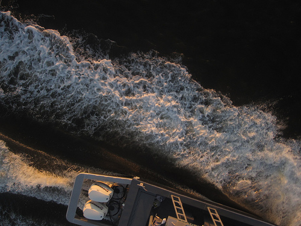
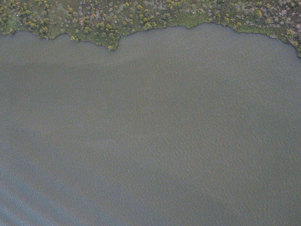

Hi, all &#8211; just posting some quick photos from our tests yesterday; i&#8217;ll post text ASAP, but just want to get these out there!

If anyone has a boat to get to Chandeleur, please contact me at 415 508 6769 or email the [mailing list](http://groups.google.com/group/grassrootsmapping/)!

An example of the kind of imagery we want to be taking, albeit in better light:

[More pictures](http://www.flickr.com/photos/jeffreywarren/tags/gulfoilmap) on Flickr (I&#8217;ll post links to full res soon but you have to be a Flickr member for now)