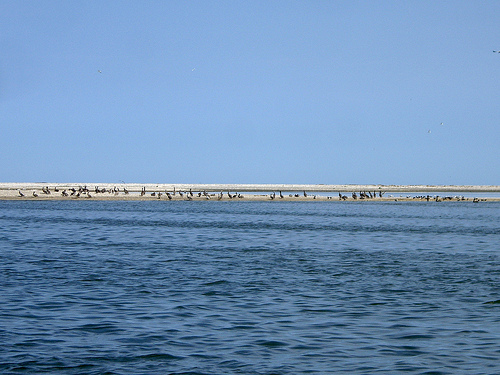

(Thanks to Jim Smith at [UptownAngler.com](http://uptownangler.com) and Spencer Moss at [FishingGuidesWorld.com](http://fishingguidesworld.com) for getting us on a boat.)

On Sunday May 9, Stewart Long, Shannon and Mariko from [Louisiana Bucket Brigade](http://www.labucketbrigade.org/), and several other volunteers made it to the Chandeleur islands on a boat and in 9mph winds were able to image the slick making its way through the island chain. There appeared to be no booms in place at that location. In the above image you can see their boat and the tether for the balloon.

More photos can be found [on this Flickr set](http://www.flickr.com/photos/jeffreywarren/sets/72157623909761885/).

_If you&#8217;re in the Gulf Coast region and can commit a few days of your time, please [sign up to volunteer](http://grassrootsmapping.org/volunteer/) and if you&#8217;re not, consider [donating to support our efforts](http://grassrootsmapping.org/donate/)!_

Here&#8217;s the location [in Google Maps](http://maps.google.com/maps?f=q&source=s_q&hl=en&geocode=&q=29.8033171892,-88.8622927666&sll=29.796559,-88.868408&sspn=0.336664,0.596695&ie=UTF8&ll=29.803319,-88.862293&spn=0.01052,0.018647&t=h&z=16).

Stewart and others from LABB are scheduled to be out on a boat today down in Port Fourchon, and we may have more imagery for you then. For now, the full dataset from today is available here, and is in the public domain:

_**Southern Chandeleur islands on Sunday May 9th**: [ sun-may-9-chandeleur-boat.zip ](http://grassrootsmapping.s3.amazonaws.com/datasets/sun-may-9-chandeleur-boat.zip) (~889mB, captured by Stewart Long, Shannon and Mariko from [Louisiana Bucket Brigade](http://www.labucketbrigade.org/), and several other volunteers)_

Many birds were congregating on the islands; in coming weeks we&#8217;ll be looking out for tarred and/or dead birds and other wildlife. One advantage to the high resolution we&#8217;re working at is that we hope to be able to pick out individual animals and plants, and thus better quantify the damage wreaked by the British Petroleum spill.

<object width="500" height="375"><param name="flashvars" value="offsite=true&#038;lang=en-us&#038;page_show_url=%2Fphotos%2Fjeffreywarren%2Fsets%2F72157623909761885%2Fshow%2F&#038;page_show_back_url=%2Fphotos%2Fjeffreywarren%2Fsets%2F72157623909761885%2F&#038;set_id=72157623909761885&#038;jump_to="></param><param name="movie" value="show.swf?v=71649"></param><param name="allowFullScreen" value="true"></param><embed type="application/x-shockwave-flash" src="http://www.flickr.com/apps/slideshow/show.swf?v=71649" allowFullScreen="true" flashvars="offsite=true&#038;lang=en-us&#038;page_show_url=%2Fphotos%2Fjeffreywarren%2Fsets%2F72157623909761885%2Fshow%2F&#038;page_show_back_url=%2Fphotos%2Fjeffreywarren%2Fsets%2F72157623909761885%2F&#038;set_id=72157623909761885&#038;jump_to=" width="500" height="375"></embed></object>