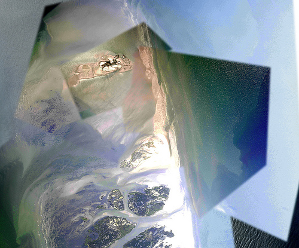

A couple updates: we&#8217;re now deep in the stitching process. Above is a preview; we hope to post one or two finished stitches today. 

Kris Ansin of Tulane and [Louisiana Bucket Brigade](http://labucketbrigade.org) is coordinating mapping teams on the ground. (He&#8217;s leading a trip today). We&#8217;ve had some donations but if you&#8217;re able to, please [donate to support our efforts](http://grassrootsmapping.org/donate/). Even $50 will buy us a tank of helium. $100 buys us a new kite. 

In the meantime we&#8217;ve had some great support from Kristian Hansen of [TungstenMonkey](http://www.tungstenmonkey.com/), a local production company. Kristian documented our training session last Saturday and has posted an intro video to our project which gets across a lot of information in a very short time. Thanks Kristian!

<object width="549" height="309"><param name="allowfullscreen" value="true" /><param name="allowscriptaccess" value="always" /><param name="movie" value="moogaloop.swf?clip_id=11734964&server=vimeo.com&show_title=1&show_byline=1&show_portrait=0&color=ffffff&fullscreen=1" /><embed src="http://vimeo.com/moogaloop.swf?clip_id=11734964&server=vimeo.com&show_title=1&show_byline=1&show_portrait=0&color=ffffff&fullscreen=1" type="application/x-shockwave-flash" allowfullscreen="true" allowscriptaccess="always" width="549" height="309"></embed></object>

[Grassrooots Mapping: Field Mapping Training](http://vimeo.com/11734964) from [TungstenMonkey](http://vimeo.com/tungstenmonkey) on [Vimeo](http://vimeo.com).