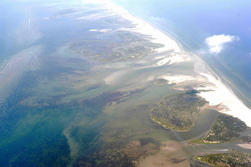

_UPDATE: Here are some notes from [Stewart Long](http://gonzoearth.com/) about his flight:_

&#8220;The Pilot reported that the restricted airspace is located below 30 degrees north latitude, and under 3,000&#8242;. Not sure what is determining the restrictions, but on Friday we were told that the minimum was 4,000&#8242;.  Visibility was pretty good. The pilot was flying VFR, and we did not encounter any other aircraft during the flight visually, or with his instruments. We did not see any booms, and only one or two boats. Lakefront airfield was pretty quiet as well. The pilot reported that the oil in the water look redder the previous day, not sure what that indicates, if anything.&#8221;  