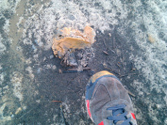
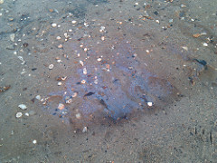

Too much wind at Waveland today to fly our balloon, and we didn&#8217;t have a kite on hand. Can anyone donate big kites like the Sutton Flowform 16? Anyone do KAP and willing to come map with us? Contact the [mailing list]() please!

On foot we found some weird stuff, some certainly petroleum&#8230; iridescent and leaving orange streaks. Other stuff was a kind of putty of orange claylike substance which was washed up with the orange streaks. Could this be oil all the way over at Waveland? It&#8217;s the same color as the stuff the mainstream press is photographing.

