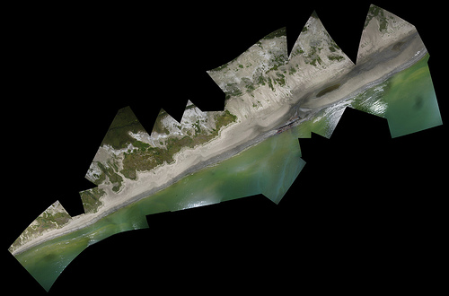

_By Lauren Craig; reposted from the [Louisiana Bucket Brigade blog](http://labucketbrigade.wordpress.com/2010/06/22/nuance-in-the-art-of-kite-mapping/)._

Since May, volunteers and staff from the LABB have been working with students from MIT's media lab on an aerial photography mapping project. The [Gulf Oil Spill Mapping project](http://grassrootsmapping.org/gulf-oil-spill/) is so simple that it baffles people: attach a basic camera to a kite or weather ballon and set it to automatically take a picture every 5, 10 or 20 seconds. Let the rig out 1000 feet and cover as much coastline as you can. The photos are then sent to some smart guys at MIT (including the project's fearless leader, Jeff Warren) who then stitch the photos together pixel by pixel and georeference them to make a map.

The simplicity of this project is what initially sparked my interest in it. The kits are assembled from relatively inexpensive materials, and almost anyone can perform the basic tasks of attaching the camera and letting out the kite or balloon. Since its inception, the project has successfully accumulated a lot of quality data. However, mapping the gulf coast oil spill is different than mapping, say, the festival grounds at Bonneroo.

The first, most obvious challenge is access. At Grand Isle, for example, the beaches remain open to the public, but only up to the water berm, about 30 feet back from the high tide mark. Even under low-wind conditions, it is almost impossible to get pictures of the coastline from this distance-especially when the Coast Guard and mysterious private security teams involved in the beach clean-up are breathing down your neck. When it is windy, the kite or balloon is carried even farther back from the coastline, and you end up with a bunch of pictures of people's camp roofs. The old standby for us there has been the pier at Grand Isle State Park, which allows us to position the kite or balloon directly over the coastline. However, it forces us to limit our mapping to a very narrow section of beach, since we are confined to the pier. In contrast, the Mississippi Coast remains open to the public and our brave volunteers have actually waded out into the water to properly position the camera over the coastline-with great results! (But, we don't know how much longer the MS beaches will remain open.)

Isle Grand Terre, a barrier island off the eastern coast of Grand Isle, hit the mainstream media a few weeks ago when its shores and wildlife were covered with thick, black oil. The day after oil hit, our volunteers were able to hitch a ride on a boat with researcher Adam Griffith from Western Carolina University and photographer [Richard Shephard](http://www.rsairphoto.com/). The amazing results of that trip can be seen here:

However, access to the island has been significantly restricted since oil was found there. On Thursday, LABB volunteer Elizabeth, HandsOn New Orleans volunteer Erin, and I were lucky enough to score a boat ride with [Greenpeace](http://www.greenpeace.org/usa/about) to Isle Grand Terre, along with a marine biologist and a filmmaker from California. Technically, Greenpeace warned us, we were not supposed to even go to the island. Getting on the beach there would require us to tow a small skiff boat and use it to ferry our group's members to the beach. The prospects for toting a heavy helium tank on a boat with 8 people and then transitioning it to an 8-foot skiff boat with a 2-stroke engine seemed dim. I opted for the kite.

The boat ride from the Bridgeside Marina on Grand Isle to the fort at Grand Terre was slow. The entire bay is essentially a no-wake zone. In addition, there are larger oil-soaked fishing and shrimping boats constantly leaving and arriving at the docks of the Sand Dollar Marina at the eastern end of the island. Booms set up around Queen Bess island and large barges transporting tanker trucks present further navigational challenges. When we finally got to the island, we saw that the clean-up operations had been effective on the beach-the four-inch thick pools of oil were gone. But, thick, brown and orange oil remained trapped in the rock jetties and the marsh grasses surrounding them. Standing on the jetty, I looked down through the spaces in the rocks at pools of oil and brown frothy mess.

It is difficult to imagine how, or if, it can ever been cleaned up. When I set up the kite, I was disappointed to find that the wind was not strong enough to lift it up to 1000 feet. The more I let out the reel, the further from the coastline the kite ventured, with little rise in elevation. The results are that we captured plenty of pictures of the island's interior, but only a few of the coastline (and these were at low elevation). My next option would have been to trail the kite behind the boat, but divergent interests among the boat's passengers and the fuel level of the boat ruled out this scenario. All in all, the mapping trip was not the most successful one we have had so far. But, it also was not a total failure. Elizabeth obtained some excellent shots of the oil on Grand Terre, dolphins looking for food in shallow water and the clean-up operations, which can be viewed on the [LABB flickr site](http://www.flickr.com/photos/labucketbrigade/).

We were also grateful to establish a relationship with Greenpeace. Having never worked with Greenpeace before, the organization's reputation for in-your-face environmental activism made me a little wary of their intentions and tactics in the gulf. Although my personal sentiments toward off-shore drilling and the energy sector are closely aligned with theirs, I recognize the importance of petroleum to the economy and culture of coastal Louisiana; and I politely keep my opinions to myself here. A moratorium on off-shore drilling is not a popular idea in Louisiana-and Grand Isle is no exception. Further, I believe that using any disaster as a backdrop to bolster a political agenda is not only exploitative, it's disrespectful. If you're going to bother coming down to the gulf right now, you better have something to offer the people that live and work here-and anti-drilling rhetoric doesn't count. Save it for Washington.

To Greenpeace's credit, I was impressed with their staff's efforts to keep a low profile and not isolate the community along political lines. The organization is funded entirely from private donations and does not endorse political candidates or accept funds from them. Their work in Grand Isle is focused specifically on providing boat transport to independent journalists, scientists and organizations who lack the funds to charter boats. Sure, they are also taking their own [pictures](http://www.flickr.com/photos/greenpeaceusa09/sets/72157623829446075/?page=2) as well. I am grateful for their services and appreciative of their respect for the sensitivity of the issue here.

<object type="application/x-shockwave-flash" width="500" height="332" data="stewart.swf?v=71377" classid="clsid:D27CDB6E-AE6D-11cf-96B8-444553540000"><param name="flashvars" value="intl_lang=en-us&#038;photo_secret=1d37391bed&#038;photo_id=4689393232&#038;flickr_show_info_box=true"></param><param name="movie" value="http://www.flickr.com/apps/video/stewart.swf?v=71377"></param><param name="bgcolor" value="#000000"></param><param name="allowFullScreen" value="true"></param><embed type="application/x-shockwave-flash" src="http://www.flickr.com/apps/video/stewart.swf?v=71377" bgcolor="#000000" allowfullscreen="true" flashvars="intl_lang=en-us&#038;photo_secret=1d37391bed&#038;photo_id=4689393232&#038;flickr_show_info_box=true" height="332" width="500"></embed></object>

The moral of this story: we can't depend solely on the generosity of Greenpeace to get us where we need to go! Boats cost money; and mainstream media outlets have a lot more of it than we do-but they don't have kites! If you are interested in our mapping project and would like to see more images of areas that are only accessible by boat, please visit our [Grassroots Mapping ](http://grassrootsmapping.org/)page to make a donation!