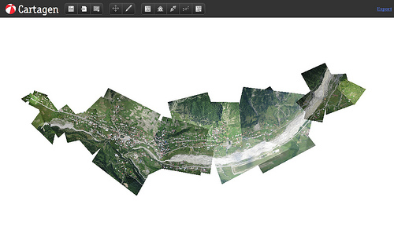

For the last few weeks, I&#8217;ve been working with [JumpStart International&#8217;s](http://jsintl.org/) project, [OpenMapsCaucasus](http://www.openmapscaucasus.org/) in Georgia, teaching balloon-mapping workshops. With OMC&#8217;s Austin Cowley, I had the amazing opportunity to travel to [Svaneti](http://en.wikipedia.org/wiki/Svaneti) in the northwest of Georgia, where we collaborated with local OMC staff and a group of enterprising school kids to map the entire city of Mestia:

The map, 5.5 kilometers from end to end, is the largest area ever mapped using these techniques, and was completed in less than 3 days, with a 6-foot helium balloon flying up to 1.4 kilometers above the ground. Below, you can see the flight paths of our first 3 launches, recorded with a lightweight GPS which we attached to the balloon:

The trip is the first of a series of mapping expeditions and workshops I&#8217;ll be teaching with OMC staff across the country, and the imagery will be used to improve the public domain map that OMC is developing. 

