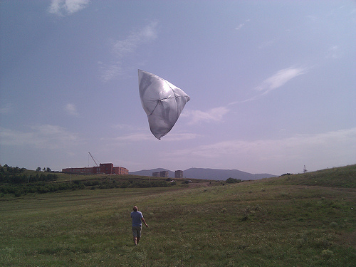

A group of tech enthusiasts and bloggers in Tbilisi Georgia joined me and Sopho from [OpenMapsCaucasus](http://openmapscaucasus.org) to prototype some solar hot air balloons for use in balloon mapping. Helium in Georgia is exorbitantly expensive &#8211; $700 for a 250-cubic foot tank, which would cost $125 in the US or $250 in the West Bank (and would last for up to 8 flights). To try to get around the helium cost issue, we&#8217;re trying a variety of other means to get cameras up in the air. 

This flight wasn&#8217;t successful &#8211; we reached only about 10 meters &#8211; but perhaps with darker plastic, or in lower winds, this could be a viable replacement for helium.

