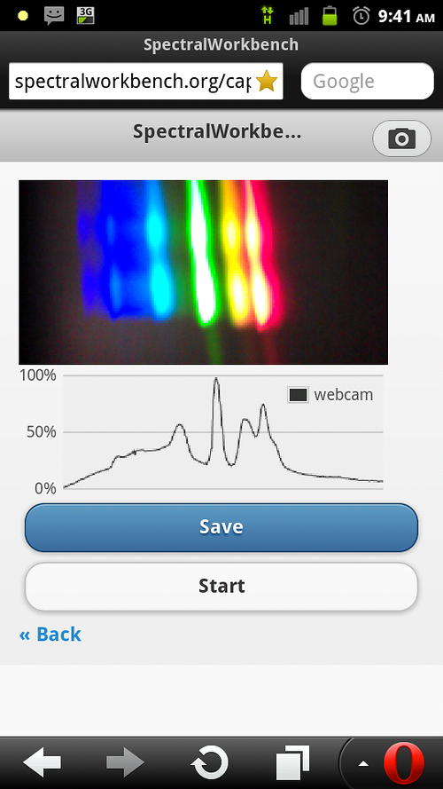

    

    

            

                            

        

    

            

                            

              

                            

              

                            

        

I just finished the first draft of this today -- it's a basic version of the Spectral Workbench spectrometer client software which simply runs in a web browser -- on an Android phone. It only works in the Opera browser (the only mobile browser which has implemented the MediaStream API).

The link: [http://spectralworkbench.org/capture](http://spectralworkbench.org/capture "http://spectralworkbench.org/capture") (it works in a regular browser too, as long as it's Google Chrome :-P )

More soon, but I took this spectrum by strapping a small spectrometer made of black paper and a slice of DVD-R to the back of my Android phone:

The data:

<iframe width='500px' height='400px' border='0' src='http://spectralworkbench.org/spectra/embed/315'></iframe>