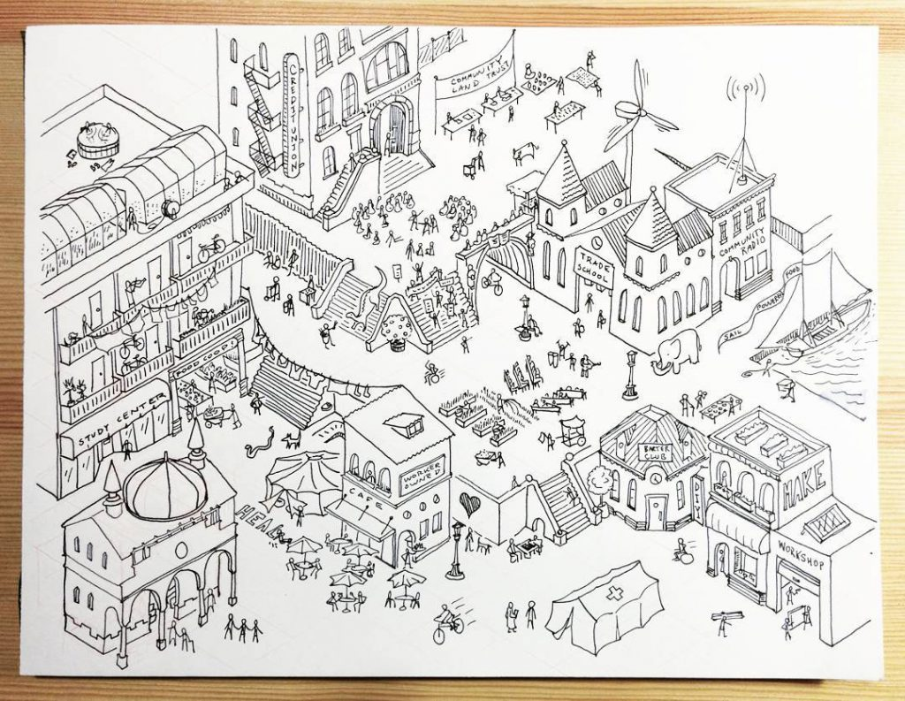

[Solidarity Economy](https://squareup.com/market/unterbahn/solidarity-economy)

 <!--
[][1]
-->

  **Solidarity Economy, Jeff Warren and Caroline Woolard, 2016**

  11x17 print; all profits go to the [Southern Poverty Law Center][2] and the [NAACP][3].

  PDF download: [Español](http://unterbahn.com/wp-content/uploads/2017/01/Solidarity-Economy-poster-Espanol-1.pdf), [English](http://unterbahn.com/wp-content/uploads/2017/01/Solidarity-Economy-poster-English-1.pdf), [中文](http://carolinewoolard.com/static/uploads/texts/Solidarity_Economy_poster_Mandarin.pdf)

  [Read more](http://carolinewoolard.com/project/redrawing-economy/) ' Translations by I-Hua Tseng & others.

* * *

**What practices and places can we rely on and strengthen in the years to come?**

What might be called an "alternative" economy in the United States is known globally as the solidarity economy. The solidarity economy identifies and unites grassroots practices like lending circles, credit unions, worker cooperatives, community safety initiatives, community media stations, and community land trusts to form a powerful base of political power. The concept emerged in the global South (as economia solidária*) and is now gaining support in the United States under many names, including the community economy, the peace economy, the workers' economy, the social economy, the new economy, the circular economy, the regenerative economy, the local economy, and the cooperative economy.

As many people finally wake up to the reality that white supremacy threatens public health on a daily basis, a wide range of people are educating themselves, assertively dismantling structures of oppression in organizations, and learning to follow the lead of black and brown artists and organizers who have been under siege for centuries and who have always been leaders in the solidarity economy. For more information about the solidarity economy, please visit: [http://www.communityeconomies.org/Home](http://www.communityeconomies.org/Home) and [http://solidaritynyc.org](http://solidaritynyc.org)

*Marco Arruda of the Brazilian Solidarity Economy Network stated at the World Social Forum in 2004: "A solidarity economy does not arise from thinkers or ideas; it is the outcome of the concrete historical struggle of the human being to live and to develop him/herself as an individual and a collective... innovative practices at the micro level can only be viable and structurally effective for social change if they interweave with one another to form always-broader collaborative networks and solidarity chains of production-finance-distribution-consumption-education-communication."

_Text by Caroline Woolard_